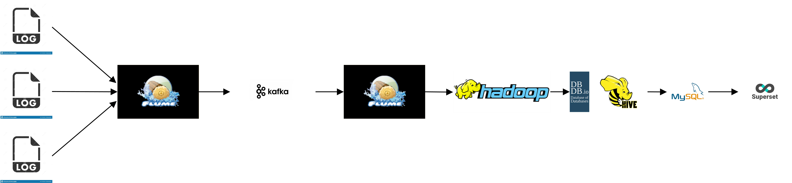

## 基于Hadoop3.0的用户行为数据离线分析可视化项目

### 项目简介

1. 完成大数据项目的架构设计安装部署。
2. 基于Hive3.0进行数据仓库的建立
3. 完成离线数据的分析
4. 产生活跃设备数（日活、月活）

所用组件为：Hadoop3.1.3、flume1.9、kafka2.11、spark3.0、hive3.1、zookeeper3.5.7、azkaban、superset

项目架构：

#### 服务器集群：使用VirtualBox虚拟机和centos7完成，hadoop102 4G，hadoop103 3G，hadoop104 3G。

| 服务名称           | 子服务                | 服务器  hadoop102 | 服务器  hadoop103 | 服务器  hadoop104 |
| ------------------ | --------------------- | ----------------- | ----------------- | ----------------- |
| HDFS               | NameNode              | √                 |                   |                   |
|                    | DataNode              | √                 | √                 | √                 |
|                    | SecondaryNameNode     |                   |                   | √                 |
| Yarn               | NodeManager           | √                 | √                 | √                 |
|                    | Resourcemanager       |                   | √                 |                   |
| Zookeeper          | Zookeeper Server      | √                 | √                 | √                 |
| Flume(采集日志)    | Flume                 | √                 | √                 |                   |
| Kafka              | Kafka                 | √                 | √                 | √                 |
| Flume（消费Kafka） | Flume                 |                   |                   | √                 |
| Hive               | Hive                  | √                 |                   |                   |
| MySQL              | MySQL                 | √                 |                   |                   |
| Azkaban            | AzkabanWebServer      | √                 |                   |                   |
|                    | AzkabanExecutorServer | √                 |                   |                   |
| Superset           |                       | √                 |                   |                   |

#### 项目步骤

1. [数据生成模块](./data_generate.md "数据生成")

